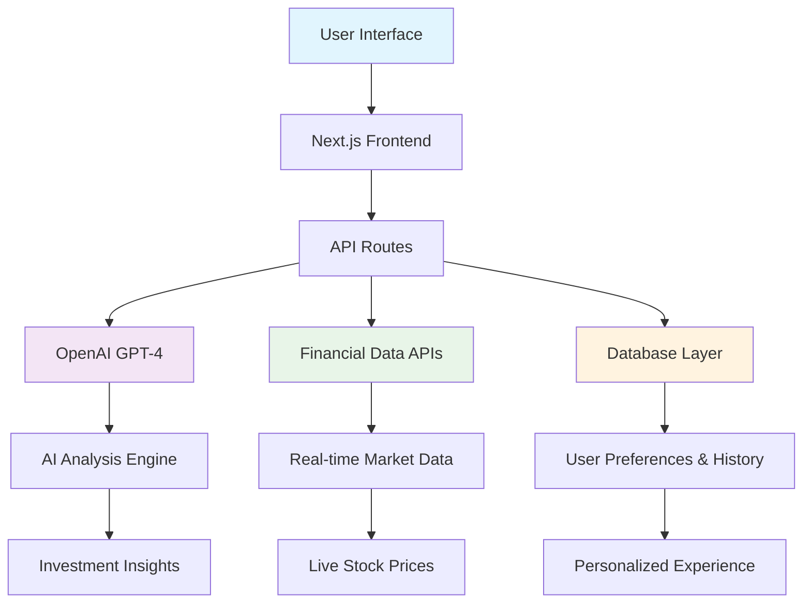

<div align="center">

# 🤖 AlgoStockGPT AI

### Your AI-Powered Financial Intelligence Platform

[](https://nextjs.org/)
[](https://www.typescriptlang.org/)
[](https://openai.com/)
[](https://tailwindcss.com/)

**Advanced Stock Analysis • Real-time Market Insights • Algorithmic Trading Strategies**

[📖 Documentation](#documentation) • [⚡ Quick Start](#quick-start) • [🖼️ Screenshots](#️-screenshots)

</div>

---

## 📋 Table of Contents

- [🎯 Overview](#-overview)
- [✨ Key Features](#-key-features)
- [🏗️ Architecture](#️-architecture)
- [🖼️ Screenshots](#️-screenshots)
- [⚡ Quick Start](#-quick-start)
- [🔧 Installation](#-installation)
- [🚀 Usage](#-usage)
- [🛠️ Configuration](#️-configuration)
- [📊 API Integration](#-api-integration)
- [🤝 Contributing](#-contributing)
- [⚠️ Disclaimer](#️-disclaimer)
- [📄 License](#-license)

---

## 🎯 Overview

**AlgoStockGPT AI** is a cutting-edge financial intelligence platform that leverages the power of artificial intelligence to provide comprehensive stock analysis, real-time market insights, and algorithmic trading strategies. Built with modern web technologies and powered by OpenAI's GPT models, it offers an intuitive interface for both novice and experienced investors.

### 💡 About This Project
**Your personal AI financial analyst, providing institutional-grade stock analysis and market intelligence through a seamless, conversational interface.**

---

## ✨ Key Features

<table>
<tr>
<td width="50%">

### 🧠 **AI-Powered Analysis**
- **GPT-4 Integration**: Advanced natural language processing for market analysis
- **Real-time Insights**: Live market data processing and interpretation
- **Smart Recommendations**: AI-driven investment suggestions
- **Risk Assessment**: Automated risk analysis and portfolio optimization

</td>
<td width="50%">

### 📊 **Market Intelligence**
- **Stock Performance Tracking**: Real-time price monitoring and analysis
- **Economic Indicators**: Key metrics like GDP, unemployment, inflation
- **Sector Analysis**: Industry-specific insights and trends
- **News Integration**: Latest market news and sentiment analysis

</td>
</tr>
<tr>
<td width="50%">

### 🔄 **Interactive Experience**
- **Conversational Interface**: Natural language queries for stock analysis
- **Suggested Actions**: Pre-built queries for quick insights
- **Multi-format Support**: Text, charts, and visual data representation
- **Dark/Light Mode**: Customizable UI themes

</td>
<td width="50%">

### 🛡️ **Security & Privacy**
- **API Key Management**: Secure storage of authentication credentials
- **Private Sessions**: Personal chat history and preferences
- **Data Encryption**: Secure data transmission and storage
- **Educational Focus**: Designed for learning, not live trading

</td>
</tr>
</table>

---

## 🏗️ Architecture



### 🔧 **Technology Stack**

| Layer | Technology | Purpose |
|-------|------------|---------|
| **Frontend** | Next.js 15, React, TypeScript | Modern web application framework |
| **Styling** | Tailwind CSS, Shadcn/UI | Responsive and beautiful UI components |
| **AI Engine** | OpenAI GPT-4, AI SDK | Natural language processing and analysis |
| **Data Sources** | Financial Datasets API | Real-time market data and indicators |
| **Database** | PostgreSQL, Drizzle ORM | User data and chat history storage |
| **Authentication** | NextAuth.js | Secure user authentication |
| **Deployment** | Vercel | Cloud hosting and deployment |

---

## 🖼️ Screenshots

### 🏠 **Landing Page - Welcome Interface**


The elegant landing page showcases the platform's core value proposition with:
- **Clean, modern design** with gradient backgrounds
- **Suggested action cards** for quick access to common queries
- **Intuitive navigation** with dark mode support
- **Professional branding** with the AlgoStockGPT AI logo

---

### 💬 **Intelligent Chat Interface**


The conversational AI interface provides:
- **Natural language processing** for complex financial queries
- **Structured responses** with numbered lists and clear explanations
- **Economic indicators breakdown** including GDP, unemployment, and inflation data
- **Sector analysis** covering technology, healthcare, and financial services
- **Interactive elements** with voting and feedback options

---

### 📈 **Advanced Market Analysis**


Professional trading interface featuring:
- **Real-time candlestick charts** with technical indicators
- **Multi-timeframe analysis** (1S, 1M, 5M, 15M, 1H, 4H, 1D, 1W)
- **Advanced charting tools** with support/resistance levels
- **Volume analysis** and price action patterns
- **Algorithmic trading signals** with buy/sell indicators
- **Professional trading platform integration** (TradingView style)

---

### 🎯 **Suggested Actions Dashboard**


Smart suggestion system with:
- **Pre-configured queries** for instant market insights
- **Color-coded categories** for different types of analysis
- **Quick access buttons** for popular stocks (Microsoft, Google, Amazon)
- **Dividend analysis tools** for income-focused investors
- **Market update notifications** and news integration

---

### 🔐 **Privacy Controls**


Comprehensive privacy management:
- **Session privacy controls** (Private/Public chat options)
- **Data access permissions** with clear explanations
- **User preference settings** for personalized experience
- **Secure authentication** with session management

---

### 🚫 **Error Handling & API Management**


Intelligent error handling system:
- **Graceful API failures** with user-friendly messages
- **Alternative data sources** suggested when primary APIs fail
- **Clear explanations** of limitations and workarounds
- **Helpful suggestions** for accessing financial data from other platforms
- **Transparent communication** about API key requirements

---

### ⚙️ **API Keys Configuration Modal**


Secure API key management interface:
- **Clean, professional modal design** for API key configuration
- **Multiple API key support** (OpenAI and Financial Datasets)
- **Secure password fields** with show/hide toggle functionality
- **Direct links** to API key generation platforms
- **Save functionality** with local storage security
- **User-friendly setup process** with clear instructions

---

### 📊 **Real-Time Stock Price Display**


Advanced stock price visualization:
- **Real-time price updates** with current market values
- **Interactive price charts** with clean line graphs
- **Key metrics display** including price changes and percentages
- **Market cap information** and trading details
- **Professional financial data presentation**
- **Responsive chart design** with hover interactions

---

### 🎯 **Investment Analysis Framework**


Comprehensive investment analysis tools:
- **Technical indicators guidance** for chart reading
- **Time frame analysis** recommendations
- **Market sentiment evaluation** tools
- **Risk management strategies** with stop-loss guidance
- **Financial analysis framework** for company evaluation
- **Interactive suggestions** for market sentiment analysis
- **Professional trading methodology** education

---

### 📈 **Enhanced Stock Visualization**


Professional-grade charting capabilities:
- **Clean, minimalist chart design** for better readability
- **Historical price tracking** with trend analysis
- **Interactive data points** for detailed information
- **Screenshot integration** showing external trading platforms
- **Follow-up query suggestions** for deeper analysis
- **Seamless user experience** with intuitive navigation

---

### 📰 **News Integration & Market Intelligence**


Comprehensive market news analysis:
- **Real-time news aggregation** from multiple sources
- **Visual news cards** with company logos and headlines
- **Structured news summaries** with key points extraction
- **Industry impact analysis** for tech sector developments
- **Regulatory news tracking** (privacy rights, investigations)
- **Market sentiment indicators** based on news content

---

### 📋 **Detailed News Analysis**


In-depth market intelligence features:
- **Comprehensive news breakdown** with numbered insights
- **Industry trend analysis** covering AI, cloud technologies
- **Regulatory impact assessment** on tech companies
- **Market significance explanations** for each news item
- **Professional news categorization** by relevance and impact
- **Actionable intelligence** for investment decisions

---

### 🤖 **AI Model Selection Interface**


Advanced AI model management:
- **Multiple GPT model options** (GPT-4.1 nano, GPT-4.1 mini, GPT-4, GPT-4o)
- **Model-specific descriptions** and capabilities
- **Performance optimization** for different query types
- **Cost-effective model selection** based on complexity
- **Seamless model switching** without losing context
- **Professional model comparison** interface

---

## ⚡ Quick Start

### Prerequisites
- Node.js 18+ 
- npm or pnpm
- OpenAI API Key
- Financial Datasets API Key (optional)

### 🚀 **One-Click Setup**

```bash
# Clone the repository
git clone https://github.com/yourusername/algostockgpt-ai.git
cd algostockgpt-ai

# Install dependencies
npm install

# Set up environment variables
cp .env.example .env.local

# Start development server
npm run dev
```

🌐 **Open [http://localhost:3000](http://localhost:3000)** to see your application running!

---

## 🔧 Installation

### **Step 1: Environment Setup**

Create a `.env.local` file in the root directory:

```env
# OpenAI Configuration
OPENAI_API_KEY=your_openai_api_key_here

# Financial Data API (Optional)
FINANCIAL_DATASETS_API_KEY=your_financial_api_key_here

# Database Configuration (Optional)
POSTGRES_URL=your_postgres_connection_string

# Authentication (Optional)
NEXTAUTH_SECRET=your_nextauth_secret
NEXTAUTH_URL=http://localhost:3000
```

### **Step 2: API Key Configuration**

1. **OpenAI API Key**: Get your key from [OpenAI Platform](https://platform.openai.com/account/api-keys)
2. **Financial Datasets API**: Sign up at [Financial Datasets](https://financialdatasets.ai/)

### **Step 3: Database Setup (Optional)**

```bash
# Generate database schema
npm run db:generate

# Run migrations
npm run db:migrate

# View database (optional)
npm run db:studio
```

---

## 🚀 Usage

### **Basic Queries**

Ask natural language questions about stocks and markets:

```
"What's Microsoft's stock price right now?"
"Give me the latest headlines about Google"
"How much has Amazon gained or lost in the past 6 months?"
"List 5 companies with a P/E ratio below 15 and dividend yield above 3%"
```

### **Advanced Analysis**

Get detailed financial insights:

```
"Analyze the technology sector performance this quarter"
"Compare Apple and Microsoft's financial metrics"
"What are the key economic indicators for the US economy?"
"Provide a risk assessment for my portfolio"
```

### **Market Intelligence**

Stay updated with real-time information:

```
"Latest market news and sentiment analysis"
"Economic calendar for this week"
"Sector rotation trends and opportunities"
"Dividend aristocrats with consistent growth"
```

---

## 🛠️ Configuration

### **API Keys Management**

The application provides a secure interface for managing API keys:

1. Click the **Settings** icon in the sidebar
2. Select **"Configure API keys"**
3. Enter your OpenAI and Financial Datasets API keys
4. Keys are stored securely in your browser's local storage

### **Theme Customization**

- **Dark Mode**: Professional dark theme for extended usage
- **Light Mode**: Clean light theme for presentations
- **Auto Theme**: Follows system preferences

### **Privacy Settings**

- **Private Chats**: Your conversations remain confidential
- **Public Chats**: Share insights with the community
- **Data Retention**: Control how long your data is stored

---

## 📊 API Integration

### **Supported Data Sources**

| Provider | Data Type | Update Frequency |
|----------|-----------|------------------|
| **Financial Datasets** | Stock prices, fundamentals | Real-time |
| **OpenAI** | AI analysis, insights | On-demand |
| **Economic APIs** | GDP, inflation, employment | Daily/Monthly |
| **News APIs** | Market news, sentiment | Real-time |

### **Rate Limits**

- **OpenAI API**: Varies by plan (see OpenAI documentation)
- **Financial Datasets**: Check your plan limits
- **Application**: No internal rate limits

---

## 🤝 Contributing

We welcome contributions! Here's how you can help:

### **Development Setup**

```bash
# Fork the repository
git clone https://github.com/yourusername/algostockgpt-ai.git

# Create a feature branch
git checkout -b feature/amazing-feature

# Make your changes and commit
git commit -m "Add amazing feature"

# Push to your branch
git push origin feature/amazing-feature

# Open a Pull Request
```

### **Contribution Guidelines**

- Follow TypeScript best practices
- Add tests for new features
- Update documentation
- Ensure responsive design
- Follow the existing code style

---

## ⚠️ Disclaimer

> **🚨 IMPORTANT: Educational Use Only**

This project is designed for **educational and research purposes only**.

### **Legal Notice**

- ❌ **Not for live trading** or real investment decisions
- ❌ **No financial advice** provided
- ❌ **No warranties** or guarantees on accuracy
- ❌ **Past performance** does not indicate future results
- ❌ **Creator assumes no liability** for financial losses

### **Recommended Use**

- ✅ **Learning** about financial markets and AI
- ✅ **Research** and analysis practice
- ✅ **Educational** projects and demonstrations
- ✅ **Portfolio simulation** and backtesting

### **Professional Advice**

Always consult with qualified financial advisors before making investment decisions. This tool should supplement, not replace, professional financial guidance.

---

## 📄 License

This project is licensed under the **MIT License** - see the [LICENSE](LICENSE) file for details.

---

<div align="center">

### 🌟 **Star this repository if you found it helpful!**

**Made with ❤️ by developers, for developers**

[⬆️ Back to Top](#-algostockgpt-ai)

</div>
